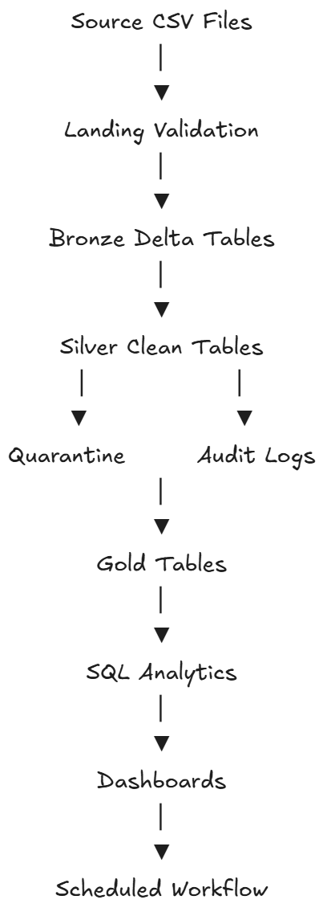
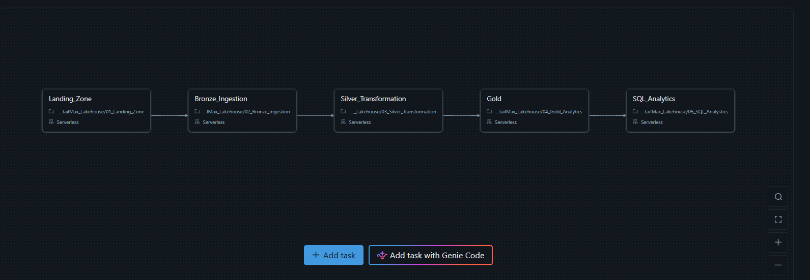

# RetailMax Enterprise Lakehouse (Databricks Project)

## End-to-End Data Engineering Project on Databricks

This project demonstrates a complete Enterprise Data Lakehouse Architecture built using Databricks (Community Edition) with PySpark, Delta Lake, and Medallion Architecture.

It simulates a real-world retail company (RetailMax) where raw CSV data is transformed into business-ready analytics datasets.

# Project Overview

RetailMax receives daily CSV extracts from its operational systems:

- Customers data
- Products data
- Orders data

These datasets were generated from ChatGPT.

# Architecture

## Medallion Architecture

Source CSV Files  
→ Landing Zone (Validation)  
→ Bronze Layer (Raw Delta Tables)  
→ Silver Layer (Cleaned + Validated Data)  
→ Quarantine + Audit  
→ Gold Layer (Business Aggregations)  
→ SQL Analytics  
→ Workflows  

# Key Features Implemented

## Bronze Layer
- Raw ingestion from CSV
- Metadata columns (ingestion_timestamp, source_file)
- Delta tables

## Silver Layer
- Data validation rules
- Data cleaning
- Quarantine handling
- Derived columns

## Gold Layer
- Business aggregations
- Customer analytics
- Product analytics
- Sales analytics

## Delta Lake
- UPDATE / DELETE / MERGE
- Time Travel
- History
- Schema Evolution

## Orchestration

- Databricks Workflows (Jobs)
- End-to-end pipeline automation

# Project Structure

notebooks/  
datasets/  
images/  

# Datasets Used

- customers.csv  
- products.csv  
- orders.csv  

# Technologies Used

- Databricks
- PySpark
- Spark SQL
- Delta Lake
- Medallion Architecture
- Workflows

# Key Learnings

- End-to-end ETL pipeline
- Data Lakehouse design
- Data validation & quarantine pattern
- Delta Lake operations
- SQL analytics
- Learnt about dashboards and SQL Queries 
- Workflows

# Conclusion
I wanted to learn Databricks, but watching hours of tutorials, so something I dont wanna invest in. I had curiosity to learn and understand Databricks properly, so I prompted ChatGPT on every topic and learnt it. Then I asked ChatGPT for a project idea, and with its help of it, I made this project. Throughout this project, I learnt about serverless compute, workbooks, PySpark, volumes, jobs, dashboards, and, more importantly, Delta Lake. 

